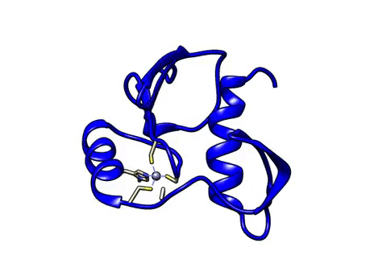
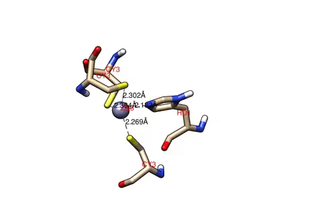

<h1><strong>Metal Ion Modeling with MCPB and MCPB.py(Amber)</strong></h1>

<em>based on tutorial form http://ambermd.org/tutorials/advanced/tutorial20/index.htm</em>

Modeling histone acetyltransferase 1 (2GIV), which has a Zn-CCCH (H as HID) cluster (with Center ID as 3) in the metal site (<em> due to an example on http://ambermd.org/tutorials/advanced/tutorial20/ZAFF.htm)</em>.

<strong>PDB files:</strong>

<em>2GIV.pdb</em>

<h2>1. Clean up pdb file and add hydrogen atoms
</h2>

leave information of atoms only in pdb:

<pre><code>awk '$1=="ATOM" || $1=="HETATM" || $1=="TER" || $1=="END"' 2GIV.pdb > 2GIV_clean1.pdb</code></pre>

Manually, we delete the residues between ALY101 to PRO274 and the ligand ACO in the pdb
2GIV_clean1.pdb and save it as  2GIV_clean2.pdb

For renumbering IDs we use pdb4amber

<pre><code>pdb4amber -i 2GIV_clean2.pdb > 2GIV_clean3.pdb</code></pre>

HIS residues protonation state was not determine (can be done through H++ website)

<h2>2.Final modification pdb to the ZAFF(Zinc AMBER force field - Peters et al., 2011) format</h2>

We manually rename CYS34, CYS37, HIS50, CYS54 residues (ligands) and ZN98 (Zn) of 2GIV_clean3.pdb file accordingly to ZAFF format (CYS to CY3, HIS to HD1, ZN to ZN3)

<h2>3. Using tleap for modeling</h2>

We use the most recent AMBER force field FF14SB for modeling

<strong>2GIV_ZAFF_tleap.in input file:</strong>

:
<pre><code>source leaprc.ff14SB</code></pre> 
Add atom types for the ZAFF metal center with Center ID 4:
<pre><code>addAtomTypes { { "ZN" "Zn" "sp3" } { "S3" "S" "sp3" } { "N2" "N" "sp3" } }</code> </pre>
Load the library for atomic ions:
<pre><code>loadoff atomic_ions.lib</code></pre> 
Load the frcmod file for monovalent metal ions (amber16 hasn't this file. It was loaded from <em>https://github.com/ParmEd/ParmEd/blob/master/test/files/parm/frcmod.ions1lsm_hfe_tip3p</em> to the AMBER'S parm directory): 
<pre><code>loadamberparams frcmod.ions1lsm_hfe_tip3p</code></pre>
Load ZAFF prep file:
<pre><code>loadamberprep ZAFF.prep</code></pre>
Load ZAFF frcmod file:
<pre><code>loadamberparams ZAFF.frcmod</code></pre>
Load the PDB file:
<pre><code>mol = loadpdb 2GIV_ZAFF.pdb</code></pre>
Bond zinc ion with SG atom of residue CYM34:
<pre><code>bond mol.98.ZN mol.34.SG</code></pre>
Bond zinc ion with SG atom of residue CYM37:
<pre><code>bond mol.98.ZN mol.37.SG</code></pre>
Bond zinc ion with SG atom of residue HID50:
<pre><code>bond mol.98.ZN mol.50.NE2</code></pre>
Bond zinc ion with SG atom of residue CYM54:
<pre><code>bond mol.98.ZN mol.54.SG</code></pre>
Save the pdb file:
<pre><code>savepdb mol 2GIV_ZAFF_dry.pdb</code></pre>
Save the topology and coordiante files:
<pre><code>saveamberparm mol 2GIV_ZAFF_dry.prmtop 2GIV_ZAFF_dry.inpcrd</code></pre>
Solvate the system using TIP3P water box:
<pre><code>solvatebox mol TIP3PBOX 10.0</code></pre>
Neutralize the system using Cl- ions:
<pre><code>addions mol CL 0</code></pre>
Save the pdb file:
<pre><code>savepdb mol 2GIV_ZAFF_solv.pdb</code></pre>
Save the topology and coordiante files:
<pre><code>saveamberparm mol 2GIV_ZAFF_solv.prmtop 2GIV_ZAFF_solv.inpcrd</code></pre> 
Quit tleap:
<pre><code>quit</code></pre>

<h2>4. MD</h2>

Input files of minimization, heating and production were performed as here: http://ambermd.org/tutorials/basic/tutorial0/index.htm

Run minimization:
<pre><code>$AMBERHOME/bin/sander -O -i 01_Min.in -o 01_Min.out -c 2GIV_ZAFF_solv.inpcrd -p 2GIV_ZAFF_solv.prmtop -r 01_Min.ncrst</code></pre>

Run heating:
<pre><code> $AMBERHOME/bin/sander -O -i 02_Heat.in -o 02_Heat.out -c 01_Min.ncrst -p 2GIV_ZAFF_solv.prmtop -r 02_Heat.ncrst -x 02_Heat.nc</code></pre>

Run production (The number of MD steps(<strong>nstlim</strong>) was reduced to 8000 to save the time of model building):
<pre><code> $AMBERHOME/bin/sander -O -i 03_Prod.in -o 03_Prod.out -c 02_Heat.ncrst -p 2GIV_ZAFF_solv.prmtop -r 03_Prod.ncrst -x 03_Prod.nc</code></pre>

<h2>5. Results of MD</h2>

 We create an MD movie in Chimera using parm file, 2GIV_ZAFF_solv.prmtop, and trajectory file, 03_Prod.nc. Created .mp4 file was transformed to gif through giphy.com (Fig. 1)

<strong>Figure 1.</strong> Molecular dynamics of 2GIV

In Chimera, the ligand residues and Zn atom with distances were generated (Fig. 2)

<strong>Figure 2.</strong> Tetrahedral coordination complex of 2GIV (ZAFF)

The next step is the processing of MD simulation temperature, density, total potential, and kinetic energies to the respective file sets through  <strong>process_mdout.perl</strong>:

<pre><code>$AMBERHOME/bin/process_mdout.perl 02_Heat.out 03_Prod.out</code></pre>

As the MD simulation density of heating doesn't include data points, We manually remove the empty data points for <strong>xmgrace</strong>(plotting program) to work. 

Plot properties:
<pre><code>xmgrace summary.TEMP</code></pre>

<pre><code>xmgrace summary.DENSITY</code></pre>

<pre><code>xmgrace summary.ETOT summary.EPTOT summary.EKTOT</code></pre>

